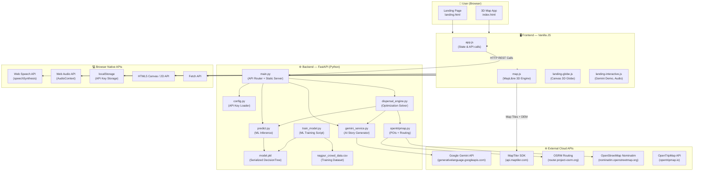
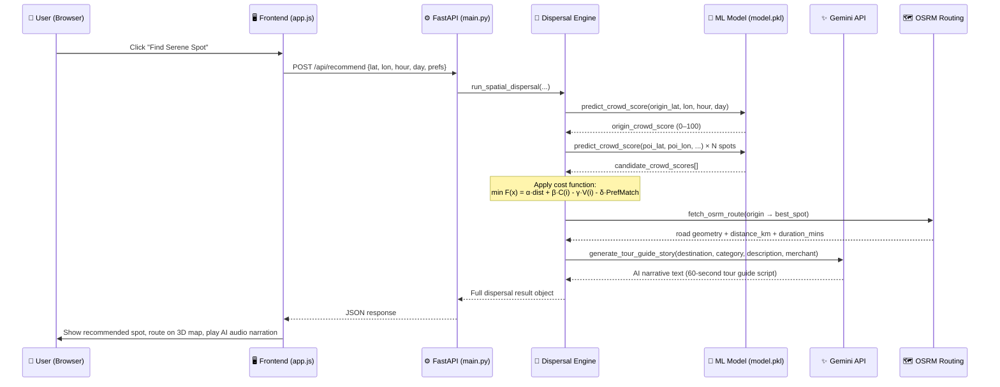
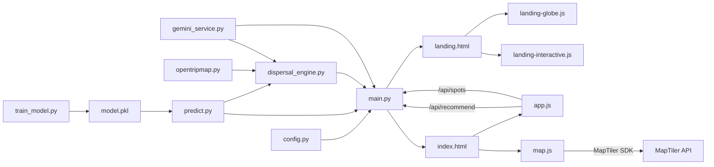

# 🧭 GeoDivert — Detailed Technical Project Report

> **AI Tourism Crowd Redistribution & 3D Spatial Engine**
> *Hackathon Project — Amravati, Maharashtra, India*

---

## 1. 📋 Project Overview

**GeoDivert** is an AI-powered, full-stack interactive web platform designed to solve **tourist overcrowding** at popular hotspots in Amravati, Maharashtra. Instead of letting tourists pile up at congested sites, GeoDivert intelligently:

1. **Predicts** crowd density at each tourist attraction using Machine Learning.
2. **Reroutes** tourists to nearby hidden cultural gems using a mathematical spatial optimization formula.
3. **Generates** personalized, warm AI-narrated 60-second audio tour guide stories via Google Gemini.
4. **Pairs** redirected tourists with nearby authentic family-owned local merchants to boost the local economy.
5. **Visualizes** everything on a stunning 3D map with real road routing vectors.

---

## 2. 🏗️ System Architecture

The platform is split into two major layers: a **Python FastAPI Backend** and a **Vanilla HTML/CSS/JS Frontend**, both served from a single local server.



---

## 3. 📁 Repository File Structure

```
Geo-Divert/
├── .env.example               ← API key configuration template
├── .gitignore                 ← Excludes .env and build artifacts
├── README.md                  ← Full setup and deployment guide
├── ML_GUIDE_FOR_BEGINNERS.md  ← ML explainer for non-technical teammates
├── run_geodivert.bat          ← One-click Windows launcher script
│
├── backend/                   ← Python FastAPI Microservice
│   ├── config.py              ← Loads API keys from .env / os.getenv
│   ├── main.py                ← Central API router + static file server
│   ├── predict.py             ← ML model inference module
│   ├── train_model.py         ← DecisionTree training & synthetic data gen
│   ├── dispersal_engine.py    ← Spatial dispersal optimization solver
│   ├── gemini_service.py      ← Gemini 1.5/2.5 Flash narrative generator
│   ├── opentripmap.py         ← Tourist POI database + OSRM routing + geocoding
│   ├── nagpur_crowd_data.csv  ← 3,000-row synthetic training dataset
│   └── model.pkl              ← Serialized DecisionTreeRegressor (binary)
│
└── frontend/                  ← Static HTML/CSS/JS Web Interface
    ├── landing.html           ← Cinematic landing page + 4 feature demos
    ├── index.html             ← Main 3D map application page
    ├── css/
    │   ├── landing.css        ← Landing glassmorphic styling
    │   └── styles.css         ← Main app frosted-glass design system
    └── js/
        ├── app.js             ← Reactive state, backend API calls, UI logic
        ├── map.js             ← MapLibre GL map engine, DEM terrain, routing
        ├── landing-globe.js   ← Canvas-drawn interactive 3D holographic globe
        └── landing-interactive.js ← Gemini story demo, Web Audio EQ visualizer
```

---

## 4. 🔄 Data Flow — Step by Step

When a user clicks **"Find My Serene Spot"**, the following pipeline executes:



---

## 5. 💻 Languages Used

| Language | Where Used | Purpose |
|---|---|---|
| **Python 3.9+** | `backend/` directory | FastAPI server, ML training, data generation, API integrations |
| **JavaScript (ES6+)** | `frontend/js/` | Application state, map rendering, audio visualizers, AI demo |
| **HTML5** | `frontend/*.html` | Page structure, semantic markup, Canvas elements |
| **CSS3** | `frontend/css/` | Glassmorphism design, animations, responsive layout |
| **Batch Script (.bat)** | `run_geodivert.bat` | Windows one-click server launcher |
| **Markdown** | `README.md`, `ML_GUIDE_FOR_BEGINNERS.md` | Documentation |
| **dotenv / env syntax** | `.env.example` | API key configuration |

---

## 6. 🛠️ Technologies & Libraries Used

### Backend (Python)

| Technology | Version / Notes | Role |
|---|---|---|
| **FastAPI** | Latest | REST API framework — routes, request models, CORS, static serving |
| **Uvicorn** | ASGI server | Serves FastAPI over HTTP on port 8000 |
| **Scikit-Learn** | `DecisionTreeRegressor` | Crowd density prediction ML model |
| **Pandas** | DataFrame library | Training data generation and inference input formatting |
| **NumPy** | Numerical library | Synthetic dataset generation (noise, random sampling, clip) |
| **Joblib** | Model serialization | Save/load `model.pkl` binary snapshot |
| **Requests** | HTTP client | Calls OSRM, Nominatim, and Gemini REST APIs |
| **google-genai** | Google GenAI SDK | Primary Gemini 1.5/2.5 Flash SDK client |
| **python-dotenv** | Environment loader | Reads `.env` file for secure API key management |
| **Pydantic** | Data validation | Request/response schema models in FastAPI |

### Frontend (JavaScript)

| Technology | Version / Notes | Role |
|---|---|---|
| **MapLibre GL JS** | `v4.1.2` (CDN) | Core WebGL 3D interactive map engine |
| **MapTiler SDK JS** | `v2.0.0` (CDN) | Extended map style tiles and terrain integration layer |
| **HTML5 Canvas 2D API** | Native Browser | 3D holographic globe, crowd dispersal curve animator, terrain visualizer |
| **Web Speech API** | Native Browser | Text-to-Speech for AI tour guide audio narration |
| **Web Audio API** | Native Browser | Real-time equalizer/spectrum visualizer during audio playback |
| **localStorage API** | Native Browser | Secure client-side storage of user-configured API keys |
| **Fetch API** | Native Browser | Async HTTP communication with FastAPI backend |
| **Google Fonts** | CDN (`fonts.googleapis.com`) | Typography: `Outfit`, `Plus Jakarta Sans` |

### External Cloud APIs

| API | Provider | Key Required | Use |
|---|---|---|---|
| **Gemini 1.5 / 2.5 Flash** | Google AI Studio | ✅ Yes (`GEMINI_API_KEY`) | AI tour guide narrative generation |
| **MapTiler Maps & DEM** | MapTiler Cloud | ✅ Yes (`MAPTILER_API_KEY`) | 3D vector map tiles + elevation terrain DEM |
| **OSRM Routing** | Project OSRM (OpenStreetMap) | ❌ Free, no key | Real road turn-by-turn driving route geometry |
| **Nominatim Geocoding** | OpenStreetMap | ❌ Free, no key | Location name → coordinates (geocoding) |
| **OpenTripMap** | OpenTripMap.io | ✅ Yes (`OPENTRIPMAP_API_KEY`) | Cultural POI lookups (configured, curated data used locally) |
| **OpenAI** | OpenAI | ✅ Optional (`OPENAI_API_KEY`) | Optional LLM fallback (configured, not actively called) |

---

## 7. 🤖 Machine Learning Module — Deep Dive

### Model: `DecisionTreeRegressor`

| Attribute | Detail |
|---|---|
| **Algorithm** | Decision Tree Regressor (`scikit-learn`) |
| **Max Depth** | 7 levels |
| **Task** | Regression → predict crowd score (0.0 – 100.0) |
| **Training File** | [`train_model.py`](file:///c:/Users/USER/OneDrive/Documents/Project%20Work%20Space/Hackathon/Geo-Divert/backend/train_model.py) |
| **Inference File** | [`predict.py`](file:///c:/Users/USER/OneDrive/Documents/Project%20Work%20Space/Hackathon/Geo-Divert/backend/predict.py) |
| **Saved Model** | `backend/model.pkl` (binary, ~15KB) |
| **R² Score** | ~0.94+ (reported in training logs) |

### Input Features (4 columns)

| Feature | Type | Description |
|---|---|---|
| `latitude` | `float` | Geographic latitude of the tourist spot |
| `longitude` | `float` | Geographic longitude of the tourist spot |
| `hour` | `int` (0–23) | Hour of the day |
| `day_of_week` | `int` (0–6) | 0=Monday … 6=Sunday |

### Output
- **`crowd_score`** → `float` between `0.0` (empty) and `100.0` (heavily congested)

### Training Data
- **3,000 synthetic rows** generated via `generate_amravati_crowd_data()`
- Covers **10 real Amravati tourist landmarks** with realistic crowd baselines
- Logic: peak hours boost, weekend multiplier, night suppression, Gaussian noise
- Spatial jitter (±~300m) added to coordinates to enable continuous regression

### Crowd Status Thresholds
| Score | Status | Map Color |
|---|---|---|
| `>= 70` | 🔴 HIGH | Red dot |
| `40 – 69` | 🟡 MEDIUM | Yellow dot |
| `< 40` | 🟢 SERENE | Green dot |

---

## 8. 🧮 Spatial Dispersal Cost Function

The core innovation of GeoDivert is its mathematical routing formula implemented in [`dispersal_engine.py`](file:///c:/Users/USER/OneDrive/Documents/Project%20Work%20Space/Hackathon/Geo-Divert/backend/dispersal_engine.py):

$$\min F(x) = \alpha \cdot d(x) + \beta \cdot C(x) - \gamma \cdot V(x) - \delta \cdot P(x)$$

| Symbol | Parameter | Weight | Description |
|---|---|---|---|
| `α` (alpha) | Distance | `0.25` | Normalized travel distance to candidate spot (km / 30km) |
| `β` (beta) | Crowd density | `0.55` | ML-predicted crowd score of candidate (0–1) |
| `γ` (gamma) | Cultural value | `0.20` | Curated cultural significance score of the destination |
| `δ` (delta) | Preference match | `0.35` | Bonus if candidate matches user's stated category preferences |

The candidate with the **lowest F(x) score** is selected as the primary recommendation. A `+1.5` penalty is added if the candidate is within `0.2km` of the origin (to prevent recommending the same location).

---

## 9. 🌐 Backend REST API Reference

Base URL: `http://127.0.0.1:8000`

| Method | Endpoint | Description |
|---|---|---|
| `GET` | `/` | Serves the cinematic landing page (`landing.html`) |
| `GET` | `/map` | Serves the main 3D map app (`index.html`) |
| `GET` | `/api/health` | Health check — returns server and ML model status |
| `GET` | `/api/config` | Returns which API keys are configured (booleans only, no secrets) |
| `GET` | `/api/spots` | All tourist spots with live ML crowd predictions for given `lat/lon/hour/day` |
| `POST` | `/api/recommend` | Full dispersal pipeline — returns best spot, route geometry, merchant, AI story |
| `POST` | `/api/predict-crowd` | Single crowd score prediction from ML model |
| `POST` | `/api/generate-story` | Standalone Gemini story generation for a given destination |
| `GET` | `/docs` | FastAPI auto-generated interactive Swagger UI |

---

## 10. 🎨 Frontend Architecture

### Page 1 — Landing Page (`landing.html` + `landing.css`)
- Cinematic hero section with glassmorphism design and gradient animations
- 3D interactive holographic globe rendered via Canvas 2D (`landing-globe.js`)
- **4 Live Feature Demo Panels** powered by `landing-interactive.js`:
  - 🗺️ Dispersal Cost Graph (interactive canvas animation)
  - 📈 Crowd Prediction Curve (24-hour timeline canvas chart)
  - 🌄 3D Terrain Visualizer (canvas depth-grid animation)
  - 🎙️ Live Gemini Narrator (Web Speech API + Audio EQ visualizer)

### Page 2 — 3D Map Application (`index.html` + `styles.css`)
- **MapLibre GL JS** renders the 3D vector map with 70° pitch and building extrusions
- **MapTiler DEM** adds real-world 3D terrain elevation data
- **OSRM** provides real road route coordinates drawn as a glowing line on the map
- Crowd density **dot heatmap** updates dynamically with ML predictions
- Collapsible sidebar panels for spot recommendations, top alternatives, merchant pairing
- **In-app API Key Modal (🔑)** lets users configure all API keys from the browser UI
- Keys saved to `localStorage` and sent dynamically with every API request

---

## 11. 🔑 Security & API Key Management

GeoDivert implements a **two-layer key strategy**:

| Method | Mechanism | Best For |
|---|---|---|
| **`.env` file** | `python-dotenv` loads at server startup, stored in `os.getenv()` | Local development |
| **In-App UI Modal** | `localStorage` in browser → passed in request body | Live demos, shared machines |

> [!IMPORTANT]
> `.env` is listed in `.gitignore` and is **never committed to GitHub**. The `.env.example` template is committed safely without real keys.

---

## 12. 🚀 Deployment & Launch

### One-Click Windows Launcher — [`run_geodivert.bat`](file:///c:/Users/USER/OneDrive/Documents/Project%20Work%20Space/Hackathon/Geo-Divert/run_geodivert.bat)

The batch script automates 6 steps:
1. Verifies Python is on PATH
2. Auto-trains `model.pkl` if missing (`python backend/train_model.py`)
3. Kills any lingering processes on port 8000 (`netstat + taskkill`)
4. Launches FastAPI via **Uvicorn** in a new terminal window
5. Waits 3 seconds for server startup
6. Opens `http://127.0.0.1:8000` in the default browser

### Manual Launch
```bash
# Install dependencies
pip install fastapi uvicorn scikit-learn pandas numpy requests python-dotenv google-genai

# Train ML model (first time only)
python backend/train_model.py

# Start server
python -m uvicorn backend.main:app --host 127.0.0.1 --port 8000 --reload
```

---

## 13. 📊 Tourist Spots Dataset (Amravati)

The ML model is trained on data simulating crowd patterns for these **10 real Amravati landmarks**:

| Landmark | Coordinates | Base Crowd | Peak Hours | Weekend Mult |
|---|---|---|---|---|
| Shri Ambadevi & Ekvira Mandir | 20.9320, 77.7523 | 45% | 9 AM–7 PM | 1.6× |
| Wadali Talao & Eco Park | 20.9580, 77.7845 | 16% | 4 PM–7 PM | 1.3× |
| Bamboo Garden Botanical Reserve | 20.9425, 77.7710 | 12% | 3 PM–6 PM | 1.25× |
| Chikhaldara Hill Station & Gawilghur Fort | 21.4010, 77.3320 | 28% | 11 AM–5 PM | 1.9× |
| Kondeshwar Shiva Temple & Waterfalls | 20.8120, 77.7680 | 15% | 10 AM–4 PM | 1.4× |
| Chatri Talao Heritage Lake | 20.9150, 77.7610 | 14% | 4 PM–7 PM | 1.3× |
| Muktagiri Waterfalls & 52 Shrines | 21.4167, 77.5333 | 22% | 10 AM–4 PM | 1.5× |
| Melghat Tiger Reserve & Eco Trails | 21.4800, 77.1500 | 8% | 7 AM–11 AM | 1.2× |
| Pandit Nehru Butterfly Park | 20.9490, 77.7660 | 11% | 3 PM–6 PM | 1.2× |
| Upper Wardha Simbhora Dam | 21.2720, 78.0580 | 15% | 12 PM–5 PM | 1.5× |

---

## 14. 🧩 Component Dependency Map



---

## 15. ✅ Summary

| Dimension | Details |
|---|---|
| **Project Type** | Full-stack AI Tourism Web Platform |
| **Domain** | Smart Tourism, Urban Crowd Management, Local Economy |
| **Target City** | Amravati, Maharashtra, India |
| **Primary Languages** | Python, JavaScript, HTML5, CSS3 |
| **Backend Framework** | FastAPI + Uvicorn |
| **ML Algorithm** | Scikit-Learn DecisionTreeRegressor (max_depth=7) |
| **Map Engine** | MapLibre GL JS v4.1.2 + MapTiler SDK v2.0.0 |
| **AI Narrator** | Google Gemini 1.5 / 2.5 Flash |
| **Routing** | OSRM (Open Source Routing Machine) |
| **Geocoding** | OpenStreetMap Nominatim |
| **Audio** | Web Speech API + Web Audio API (EQ visualizer) |
| **Security** | .env + localStorage dual-layer API key management |
| **Deployment** | Local server (Windows `.bat` launcher) |
| **Swagger Docs** | Auto-generated at `/docs` |
